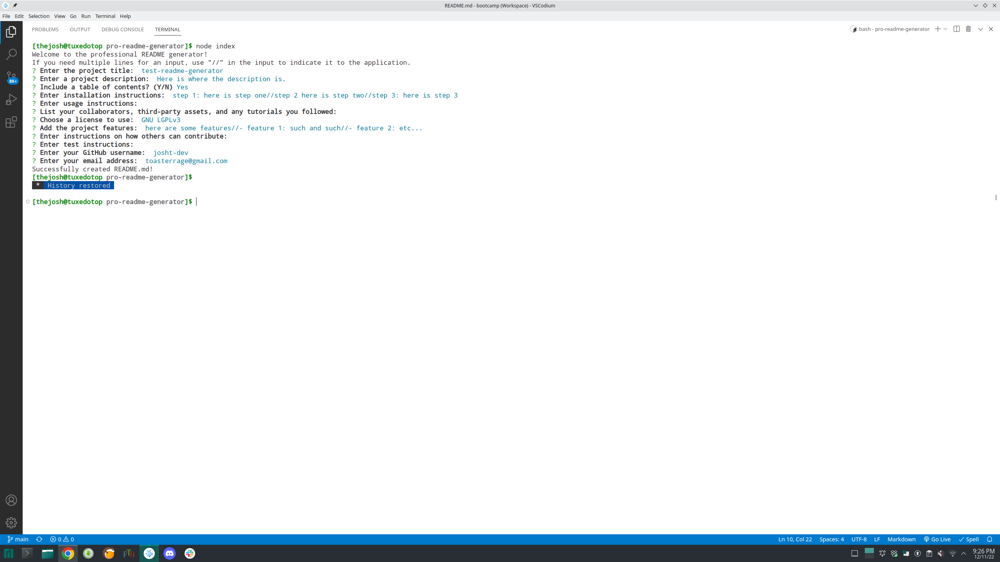

# PRO-README-GENERATOR

## Description

This NodeJS application was created to facilitate the quick creation of quality professional README's for projects. It uses NodeJS with the Inquirer and FS modules. I learned a lot about string formatting in JavaScript and the use of modules while working through the challenges of this project.

## Installation

- Clone the GitHub repo for the pro-readme-generator application.

- Install NodeJS version 16.18.0. Any v16 will probably work, but the project specifically used v16.18.0. You can find installation instructions for Windows and macOs here: https://coding-boot-camp.github.io/full-stack/nodejs/how-to-install-nodejs. See your app store for the various linux distributions and install the v16 gallium version of the NodeJS package. This will also install NPM.

- Once NodeJS is installed, install inquirer 8.2.4 with a terminal opened in the project directory with the following command line: npm i inquirer@8.2.4

## Usage

Open a terminal in the project directory and run the command 'node index'. Answer the prompts in the terminal. Any required inputs or format has validation to check the user input. Once all the prompts are answered, the completed README.md file is saved to the output folder in the project directory.

Here is a video walkthrough: https://drive.google.com/file/d/1eKPAWlSNdhDun44JAGzpx94XVxCjRRBp/view

## Credits

I used the following tutorial for the email address validation: https://www.abstractapi.com/guides/email-validation-regex-javascript#:~:text=The%20Javascript%20Regex%20object%20provides,That's%20it!

## License

Refer to the LICENSE in the repo.